## Performance Profiling

Для оценки производительности приложения использовался React DevTools Profiler.

### Измерения включали:

- Сортировку столбцов
- Поиск по стране
- Выбор другого года
- Добавление/удаление столбцов

C React.memo и useMemo
- 1.Сортировкa по имени 
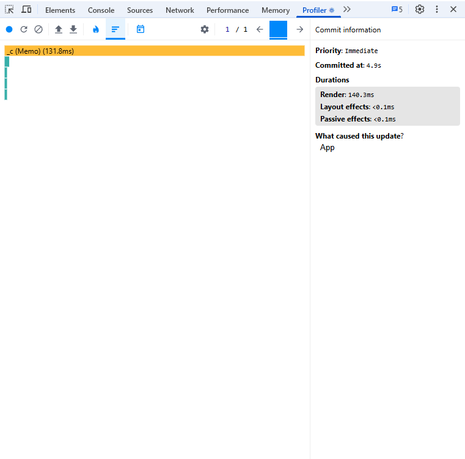
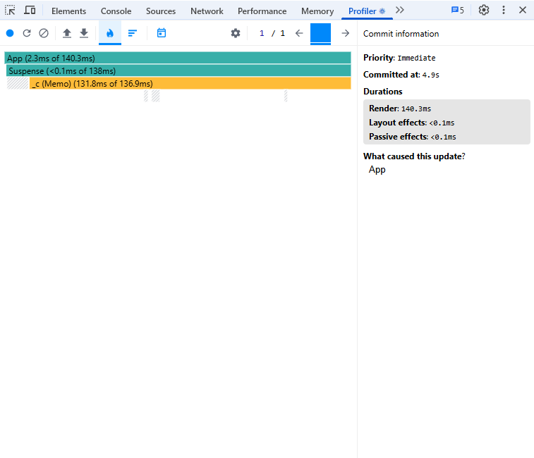
- 2.Поиск по стране
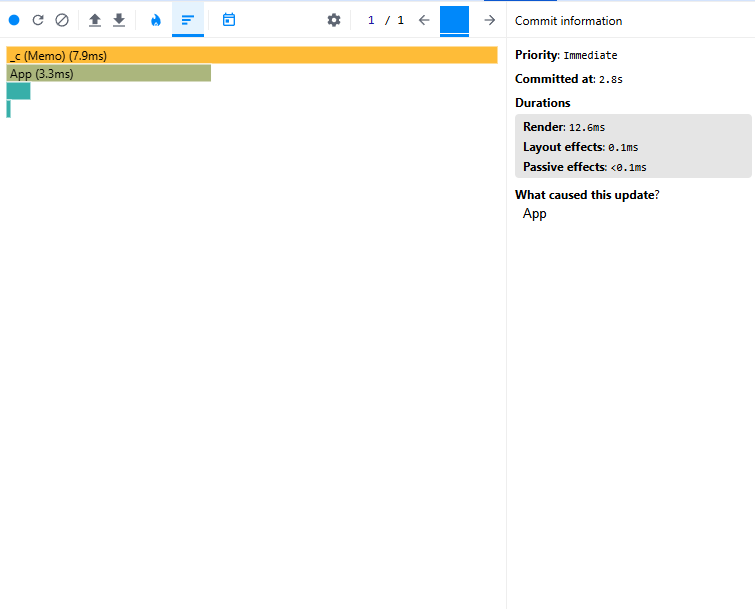
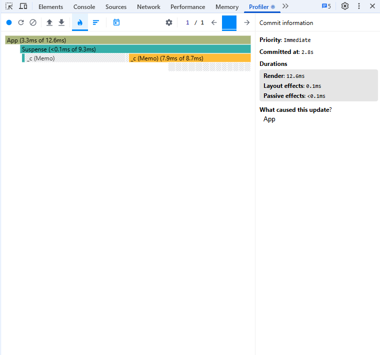
- 3.Выбор другого года
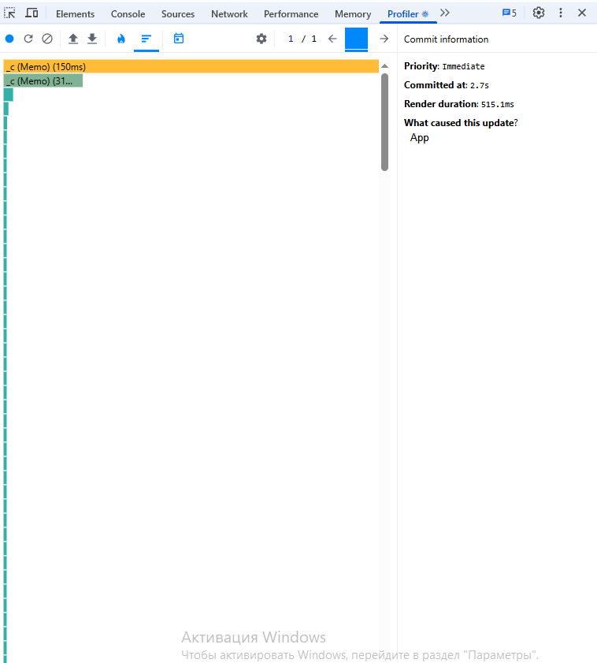
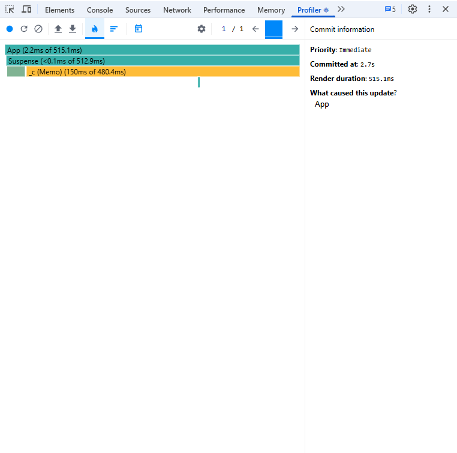
- 4.Добавление столбцов
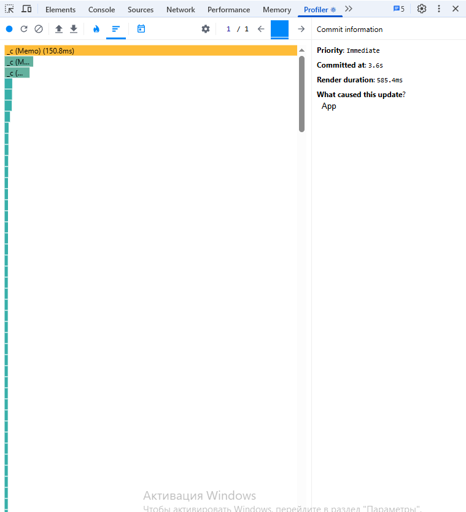
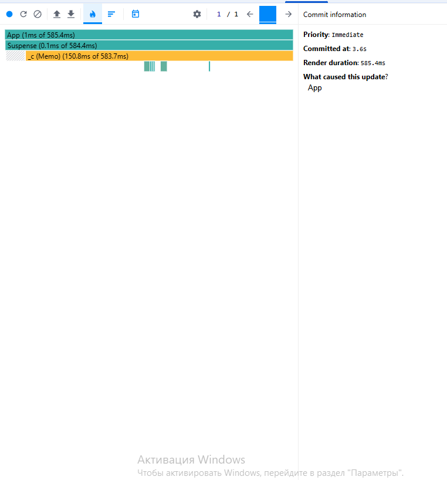
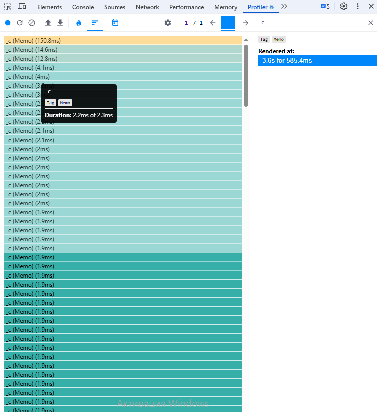
- 5.удаление
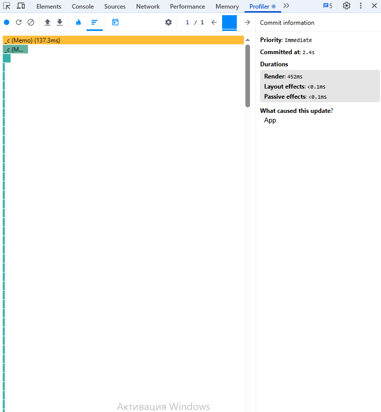
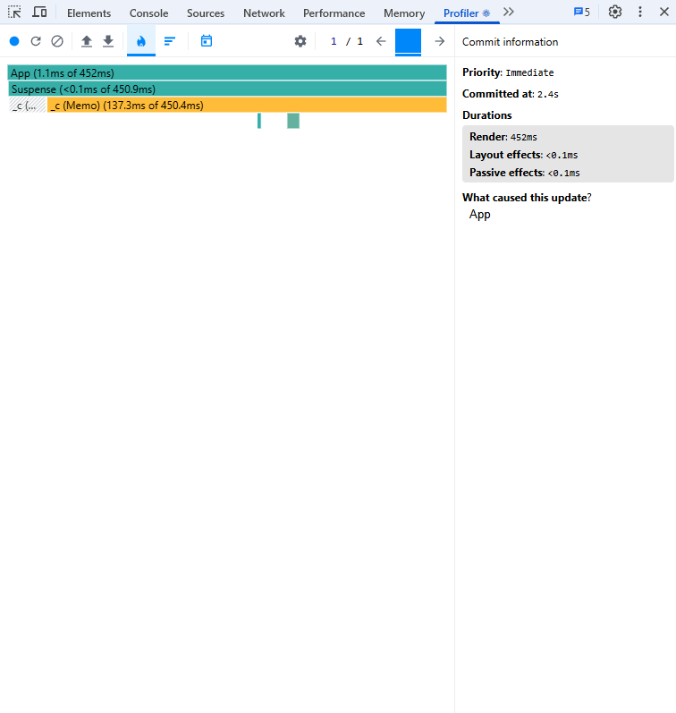
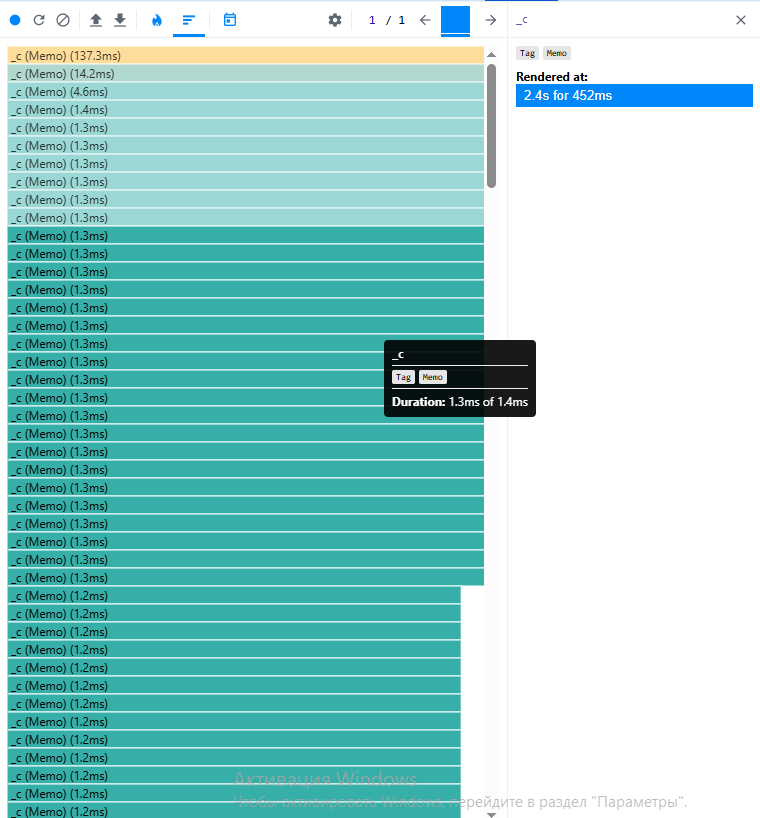
